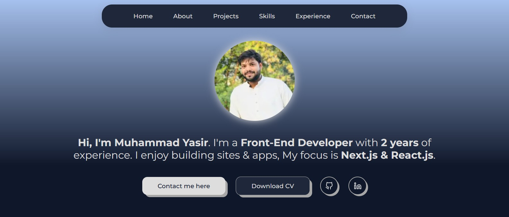

# 🌐 Muhammad Yasir – Personal Portfolio (Next.js)



A modern, responsive and SEO-friendly **Next.js** based personal portfolio web application showcasing my skills, projects and experience as a Front-End / Web Developer.

---

## 📝 Overview

The **Muhammad Yasir – Personal Portfolio** is a Next.js web application designed to provide an interactive and informative platform to present my skills, projects, and experience.  

It features both light and dark themes so visitors can customize their viewing experience.  
All the content on this portfolio is personalized and tailored to highlight my expertise and achievements.

---

## 🌐 Live Website

Explore the live website here: [Muhammad Yasir – Personal Portfolio](https://yasir-portfolio-nextjs.vercel.app/)

Connect with me on LinkedIn: [Muhammad Yasir](https://www.linkedin.com/in/yasirweb/)

---

## ✨ Features

- 🎨 **Custom Content** – Every section is customized to highlight my skills, projects, and achievements.  
- 🌓 **Light and Dark Mode** – Choose your preferred viewing mode with a user-friendly theme switcher. Supports both automatic mode (system preference) and manual mode.  
- 📬 **Contact Form** – Easily get in touch with me using the contact form. Messages reach me directly and I respond as soon as possible.  

---

## 🌓 Light and Dark Mode

My portfolio supports both light and dark modes, giving visitors the flexibility to choose their preferred viewing experience.

- **Automatic Mode:** Follows your system preference by default.  
- **Manual Mode:** Manually toggle between light and dark themes using the built-in theme switcher.

### ⚙️ Implementation Details

The light and dark mode implementation is achieved using the `useContext` API.  
Your theme choice is stored in context so the setting persists across pages.

### 📚 Usage

To maintain a consistent dark mode experience, embedded content or showcased projects also follow dark mode styling.

---

## 🤝 Contributing

Suggestions to enhance and optimize the light/dark mode or add new features are welcome!  
Open an issue or pull request if you’d like to contribute improvements.

---

## 📦 Scripts

| Command         | Description                            |
|-----------------|----------------------------------------|
| `npm run dev`   | Start local development server          |
| `npm run build` | Build production-optimized application  |
| `npm run start` | Run production build locally            |
| `npm run lint`  | Run Next.js linting                     |

---

## 🛠️ Tech Stack

- [Next.js](https://nextjs.org/) – React framework  
- [React](https://reactjs.org/) – UI library  
- [Tailwind CSS](https://tailwindcss.com/) – Styling  
- [Vercel](https://vercel.com/) – Hosting  

---

## 📂 Project Structure

```bash
muhammad-yasir-portfolio/
├── public/             # Static assets (images, icons)
├── pages/              # Next.js pages & routing
├── components/         # Reusable UI components
├── styles/             # Global styles
└── README.md

git clone [https://github.com/<your-username>/muhammad-yasir-portfolio.git](https://github.com/myasirweb/yasir-portfolio-nextjs)
cd muhammad-yasir-portfolio
npm install
npm run dev
npm run build
npm start
